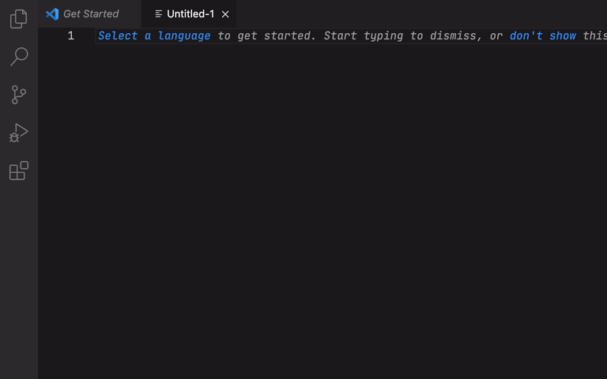

# UUID Generator
## Simple to use

## Copy and Paste

## Source
[Github](https://github.com/arenchen/vscode-uuid-generator)

## License
This Visual Studio Code extension is open-source software licensed under the [MIT license](LICENSE).